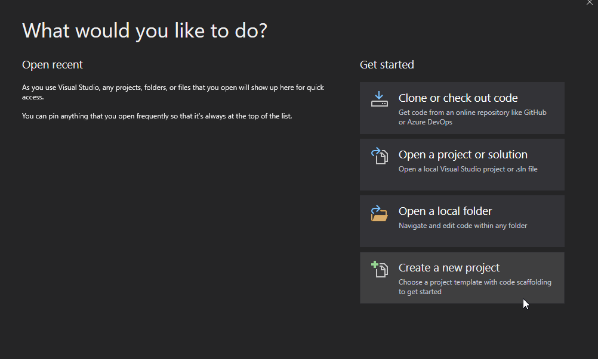
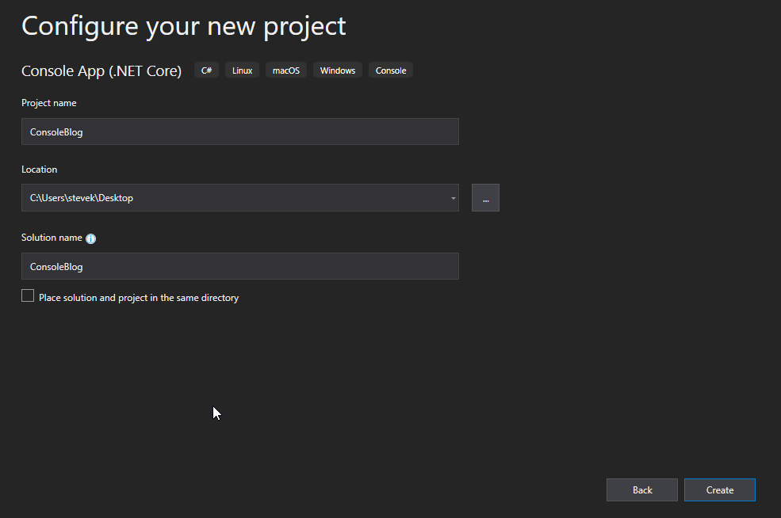
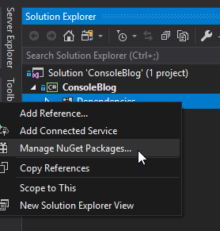
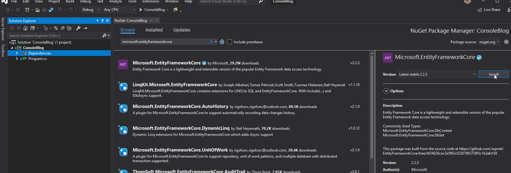
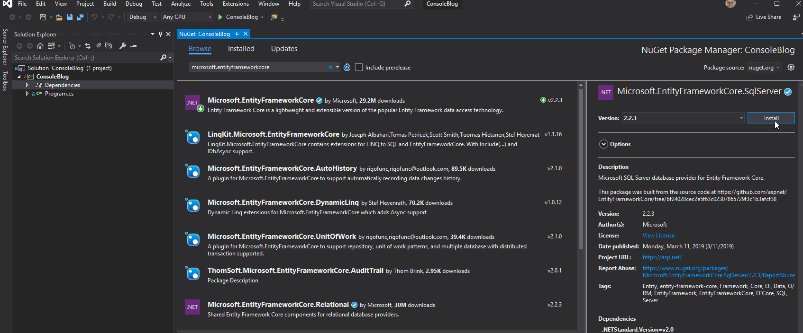

# Module-1-Getting-Started

## Course Introduction
In this module I am going to explain how this course is layed out, the resources
for the content, and how homework will be assigned and graded.

This course follows the [microsoft documentation][docs] closely. Much of the content comes from this site
and we will be working through the different articles. You can think of this course
as working through this document together. Some of the content is suplemented by the book
[Entitiy Framework Core In Action][book].

Each module will consist of a lecture with a workshop, homework for you to complete on your own,
and an assigned reading for the next module. The modules will all be recorded and I will monitor the
teams channel closely for any questions.

## Install dotnet core

In order to get started we will need to make sure we are all have dotnet core installed. I am running
version 2.2. Dotnet core versions can be installed side by side. You will need to install the SDK.

[download and install dotnetcore][install]

or use the powershell script<br />
[https://dot.net/v1/dotnet-install.ps1](https://dot.net/v1/dotnet-install.ps1)

## Create an empty console application

In visual studio create new console application called ConsoleBlog. The images below are from
visual studio 2019.





## Create First application with EF Core

In visual studio, open the project and add the nuget packages.





<details>
<summary>Create a new BloggingContext.cs in the project</summary>

``` cs
using Microsoft.EntityFrameworkCore;
using System.Collections.Generic;

namespace Intro
{
    public class BloggingContext : DbContext
    {
        public DbSet<Blog> Blogs { get; set; }
        public DbSet<Post> Posts { get; set; }

        protected override void OnConfiguring(DbContextOptionsBuilder optionsBuilder)
        {
            optionsBuilder.UseSqlServer(
                @"Server=(localdb)\mssqllocaldb;Database=Blogging;Integrated Security=True");
        }
    }

    public class Blog
    {
        public int BlogId { get; set; }
        public string Url { get; set; }
        public int Rating { get; set; }
        public List<Post> Posts { get; set; }
    }

    public class Post
    {
        public int PostId { get; set; }
        public string Title { get; set; }
        public string Content { get; set; }

        public int BlogId { get; set; }
        public Blog Blog { get; set; }
    }
}
```
</details>

Restore nuget packages on the solution.

<details>
<summary>Create a blog entry and ensure a database has been created.</summary>

```cs
using (var db = new BloggingContext())
{
    db.Database.EnsureCreated();
    var blog = new Blog { Url = "http://sample.com" };
    db.Blogs.Add(blog);
    db.SaveChanges();
}
```
</details>

**Note:** The line `db.Database.EnsureCreated()` is a new EF Core command that will create a database that matches the model if it does not already exist. This command does not require entitiy framework migrations which we will cover later.

<details>
<summary>Query for the blog entries and print out the results to the console.</summary>

```cs
using (var db = new BloggingContext())
{
    var blogs = db.Blogs;
    foreach (var blog in blogs)
    {
        Console.WriteLine($"Blog item found {blog.BlogId}.");
    }
}
```
</details>

<details>
<summary>Full Program.cs</summary>

```cs
using Intro;
using System;

namespace ConsoleBlog
{
    class Program
    {
        static void Main(string[] args)
        {
            using (var db = new BloggingContext())
            {
                db.Database.EnsureCreated();
                var blog = new Blog { Url = "http://sample.com" };
                db.Blogs.Add(blog);
                db.SaveChanges();
            }

            using (var db = new BloggingContext())
            {
                var blogs = db.Blogs;

                foreach (var blog in blogs)
                {
                    Console.WriteLine($"Blog item found {blog.BlogId}.");
                }
            }

            Console.WriteLine("Hello World!");
        }
    }
}
```
</details>

## Review

In this module we made sure we have all the tools needed for this course.
Visual Studio, and dotnet core were installed. We demonstrated that we
can create a simple console application with the components necessary to use
entitiy framework core for sql server database access. If you would like you can inspect the
sql instance install [SSMS][ssms] and then connect to `(localdb)\mssqllocaldb`. This is the
default sql express instance.

The first time this application runs, it will see that no database exists, and will create one. Then on subsequent runs it will create 1 more blob entitiy, then query for all blog entities using different contexts.

## Complete

After you are done creating the project. Please commit and push the changes to master.
Then please email me to let me know.

[docs]: https://docs.microsoft.com/en-us/ef/core
[book]: https://www.amazon.com/Entity-Framework-Core-Action-Smith/dp/161729456X/ref=sr_1_fkmrnull_1?keywords=entity+framework+core+in+action&qid=1554387441&s=gateway&sr=8-1-fkmrnull
[install]: https://dotnet.microsoft.com/download
[ssms]: https://docs.microsoft.com/en-us/sql/ssms/download-sql-server-management-studio-ssms?view=sql-server-2017
